## 

::: {.columns}
::: {.column }
### Objetivo de Aprendizagem:
- O aluno será capaz de identificar os principais conceitos da Gestão Enxuta e elaborar um plano de ação considerando os desperdícios definidos na Gestão Enxuta.
:::
::: {.column}

:::
:::
:::


## 

::: {.content}
{width="30%"}
<br/>
Quem é ele?
:::


## 

::: {.content}
{width="30%"}  
<br/>
Henry Ford
<br/>
<br/>
[O que ele fez?]{.bigger}

:::
## 

::: {.content}
{width="70%"}  
<br/>
[Linha de Produção](https://en.wikipedia.org/wiki/Assembly_line)
:::

## {.image-right}

::: columns
::: {.column width="45%"}
### O pensamento de Henry Ford
::: {style="font-size: 0.9em;font-style: italic;"}
- Nada é difícil se for dividido em pequenas partes.
- Não encontre um defeito, encontre uma solução.
- O cliente pode ter o carro que quiser, contanto que seja preto.
- Pensar é o trabalho mais difícil que existe. Talvez, por isso, tão poucos se dediquem a ele.
:::
:::
::: {.column width="55%"}
:::
:::

{.image-right}

## 

::: {.content}
{width="260%"}
<br/>
Quem é ele?

:::

## 

::: {.content}
{width="260%"}
<br/>
Taiishi Ohno
<br/>
<br/>
[O que ele fez?]{.bigger}

:::


## 

::: {.content}
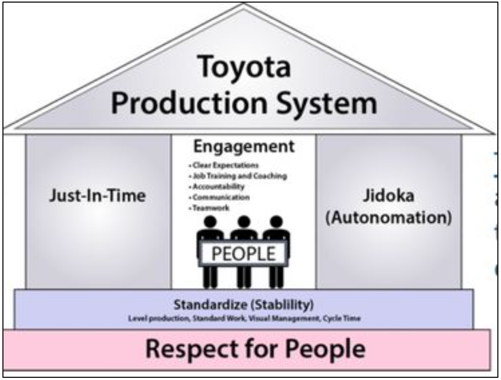{width="70%"}
<br/>
[Toyota Production System](https://en.wikipedia.org/wiki/Toyota_Production_System)
:::

## {.image-right}

::: columns
::: {.column width="45%"}
### O pensamento de Taiishi Ohno
::: {style="font-size: 0.7em;font-style: italic;"}
- A ausência de problemas é o maior de todos os problemas.
- Sem padrões não há melhorias. Os padrões não devem ser forçados de cima para baixo, mas criados pelos próprios trabalhadores.
- O método Toyota não é o de criar resultados trabalhando duro. É um sistema que considera que não há limites para a criatividade das pessoas. As pessoas não vêm para a Toyota para trabalhar, elas vêm para pensar.
- O local de trabalho é um professor. Você só consegue achar respostas no local de trabalho.
:::
:::
::: {.column width="55%"}
:::
:::

{.image-right}

## 

### Conceitos da Gestão Enxuta
<br/>

::: {.container}
Conforme [@nakamuro_re-translating_2017]
:::

## 
::: {.columns}
::: {.column}
### [Kaizen]{.rn-fragment rn-type=circle rn-color=yellow}
- Foi traduzido livremente como "Melhoria Contínua", mas possui um significado mais profundo, conforme pretendido por Taiishi Ohno.
- Kaizen não é sobre melhorias físicas.
:::

::: {.column}
### [Kairyo]{.rn-fragment rn-type=circle rn-color=yellow}
- Ohno costumava utilizar a palavra japoneza Kairyo para descrever a melhoria contínua que se concentra principalmente em melhorias físicas, de processos, tecnologias ou máquinas.
:::
:::
[Kaizen é sobre mudar o comportamento de alguém para beneficiar os outros. É um estado de espírito.]{.rn-fragment rn-type=underline rn-color=#ebd728}

##

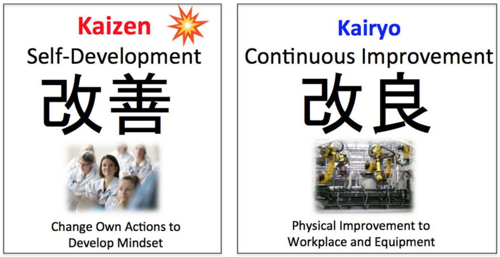

##

### Jidoka

::: {.columns style="display: flex;"}
::: {.column width=45%  style="flex: 1;font-size:0.8em"}
- O TPS possui 2 pilares: [Just-in-Time]{.rn-fragment rn-type=underline rn-color=#edeace}
 e [Jidoka]{.rn-fragment rn-type=underline rn-color=#edeace}.
- Manuais _Lean_ explicam que a palavra *Jidoka* significa "humanos ajudando máquinas quando erros acontecem".
- Costuma ser traduzido como:
  - [automação com um toque humano]{.rn-fragment rn-type=box rn-color=yellow}.
:::

::: {.column style="flex: 1; display: flex; flex-direction: column; justify-content: top; align-items: right; gap: 10px; text-align: right;"}
{width="80%"}
:::
:::


##

### Trabalho Verdadeiro & Gemba


::: {.columns style="display: flex;"}
::: {.column width="60%" style="flex: 1;font-size:0.7em"}
- Ohno queria que o trabalhador fosse capaz de diferenciar o ["trabalho verdadeiro"]{.rn-fragment rn-type=box rn-color=yellow} de ["movimentação"]{.rn-fragment rn-type=box rn-color=yellow}.
  - Todo movimento que agrega valor ao produto é chamado de "trabalho verdadeiro".
  - Movimento que não agrega valor é chamado de "movimentação" e é considerado um desperdício.
- A forma mais efetiva de identificar o "trabalho verdadeiro" da "movimentação" é através da [participação direta no local de trabalho (Gemba)]{.rn-fragment rn-type=underline rn-color=yellow}.
:::
::: {.column style="flex: 1; display: flex; flex-direction: column; justify-content: top; align-items: right; gap: 10px; text-align: right;"}
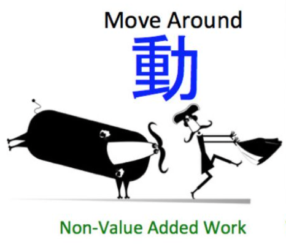{style="max-height: 280px;"}
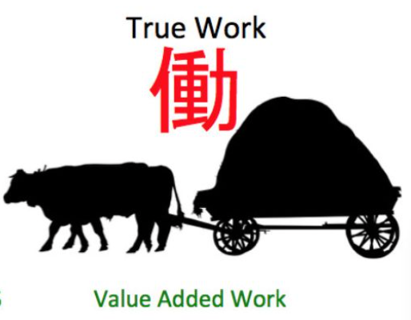{style="max-height: 260px;"}

:::

:::

## 

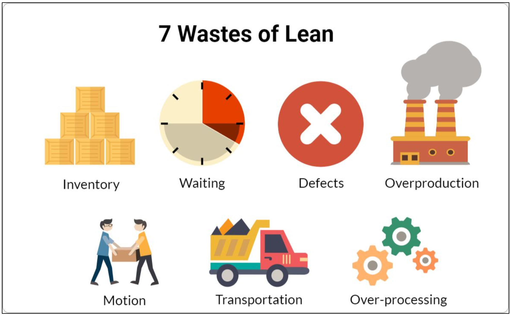

## Exercício

Identifique os 7 desperdícios conforme são apresentados no vídeo deste [link](https://www.youtube.com/watch?v=CJSZj9bShAI&list=PLRUJVODggDtOkOhYGzQ4hmxv_irReNKSs&index=14).


## Exercício

Quais ações apresentadas no vídeo podemos mapear em cada um dos desperdícios?    

```{r}
library(tidyverse)
library(gt)
wastes <- tibble(
  `Desperdícios na Manufatura` = c("Transporte", "Estoque", "Movimentação", "Espera", "Produção em Excesso", "Processamento em Excesso", "Defeitos"),
  `Ação` = c(".  .  .", ".  .  .", ".  .  .", ".  .  .", ".  .  .", ".  .  .", ".  .  .")
)
wastes |> 
  gt() |> 
  opt_stylize(style = 3) |> 
  tab_style(
    style = cell_borders(
      sides = "right",
      color = "black",
      weight = px(3),      # Thick line
      style = "solid"),
    locations = list(
      cells_body(columns = everything()),         # Draws line on the right of body cells
      cells_column_labels(columns = everything()) # Draws line on the right of the header
    )
  ) |> 
  tab_options(
    table.font.size = px(32) # Changes the entire table size
  )

``` 


##
:::{.fragment}
O [segundo pior problema]{.rn-fragment rn-type=circle rn-color=yellow} na gestão de projetos de TI é...
:::
:::{.fragment}

:::


## Tecnologia da Informação e Desperdícios da Gestão Enxuta 

```{r}
library(tidyverse)
library(gt)
wastes <- tibble(
  `Desperdícios na Manufatura` = c("Transporte", "Estoque", "Movimentação", "Espera", "Produção em Excesso", "Processamento em Excesso", "Defeitos"),
  `Desperdícios em TI` = c("Hand-offs", "Trabalho parcial", "Troca de tarefas", "Atrasos", "Escopo adicional", "Reaprendizagem", "Defeitos")
)
wastes |> 
  gt() |> 
  opt_stylize(style = 3) |> 
   tab_options(
    table.font.size = px(32) # Changes the entire table size
  )

``` 

##
:::{.fragment}
O [pior problema]{.rn-fragment rn-type=circle rn-color=yellow} na gestão de projetos de TI é...
:::


##
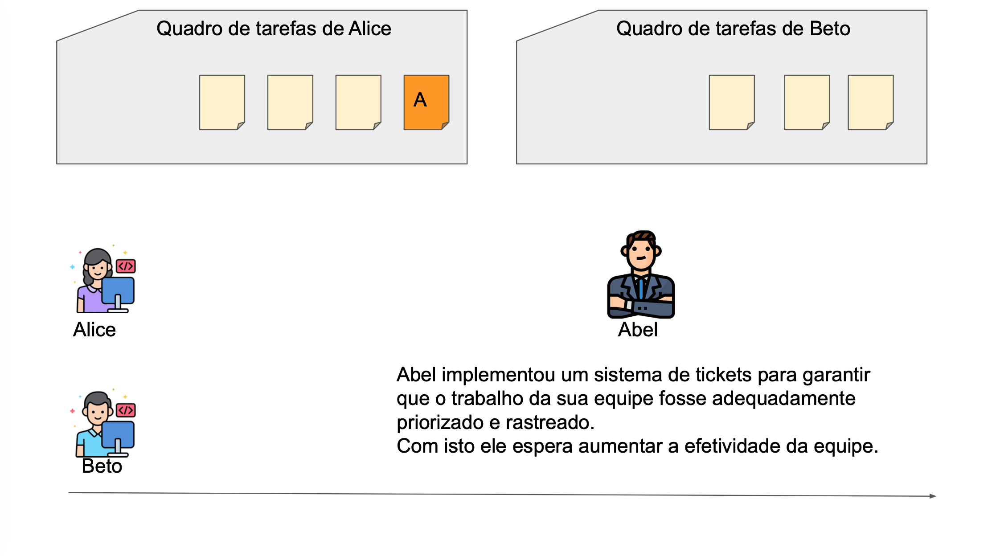

##
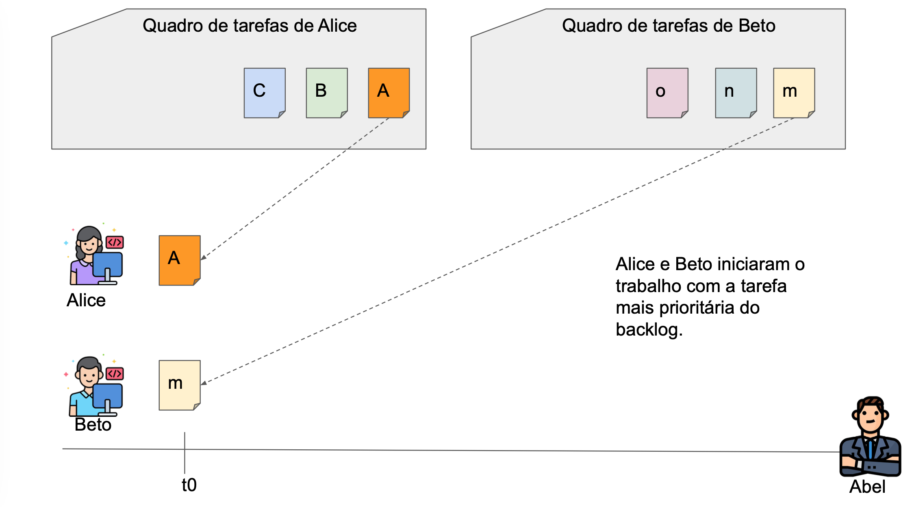

##
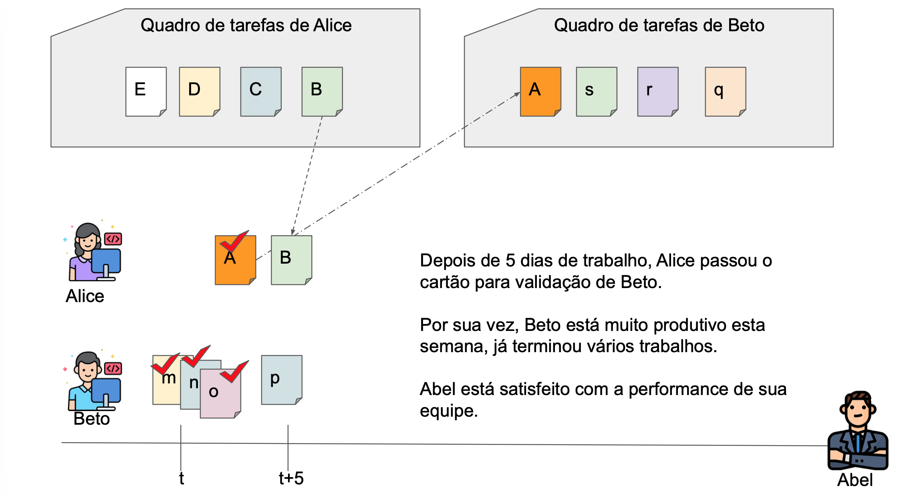

##
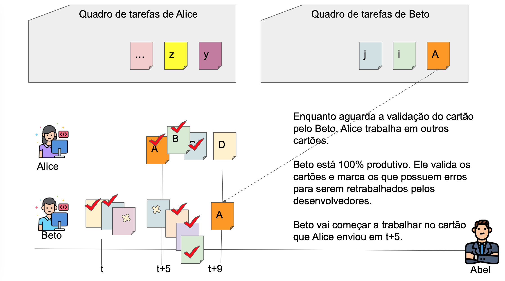

##
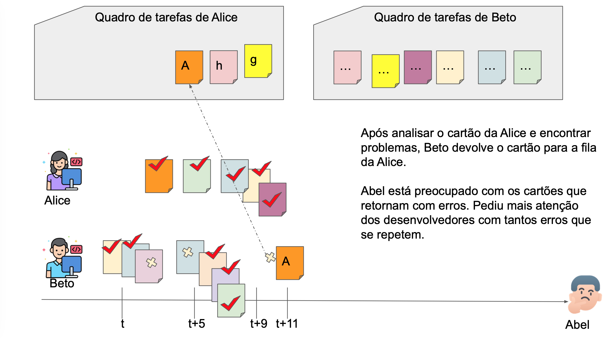

##
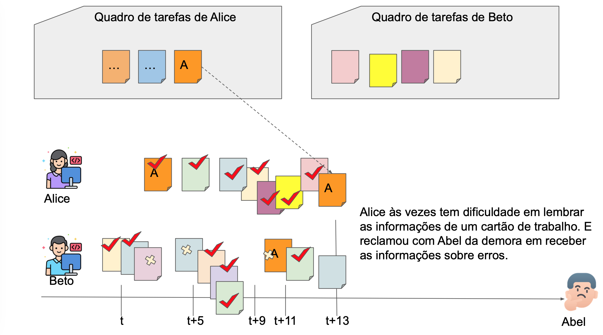

##
O [pior problema]{.rn-fragment rn-type=circle rn-color=yellow} ...     

::: {.fragment}
... o mais cruel, nefasto, pernicioso, impiedoso, desumano, mefistofélico problema na gestão de TI...     
:::   

:::{.fragment}
{style="max-height: 280px;"}      
**ESPERA**
:::

:::{.fragment}
[QUEM]{.rn-fragment rn-type=circle rn-color=yellow} está esperando?
:::

##
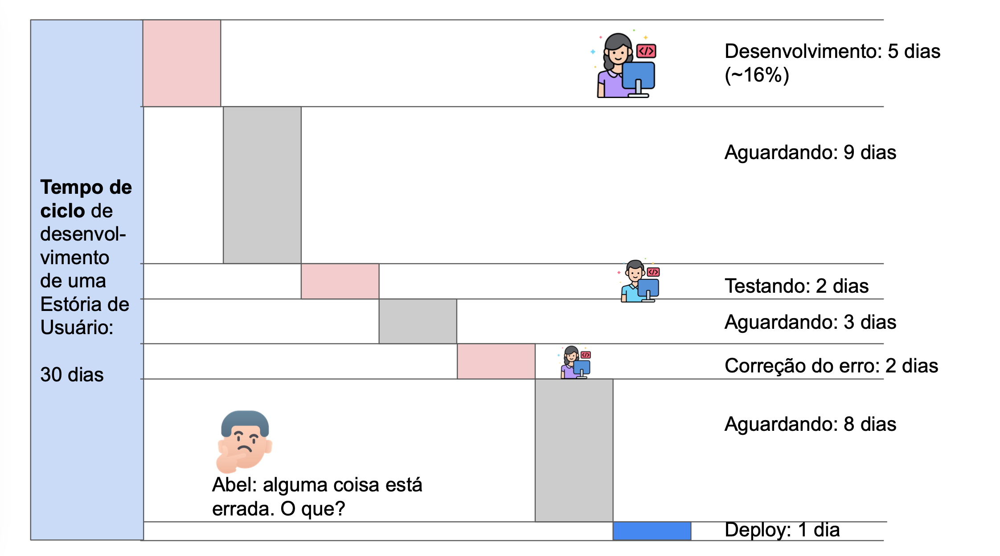

## 
:::{.message-box}
As datas de vencimento não levam em consideração o tempo de espera. E o problema geralmente não está no tempo de processo, mas no tempo de espera. Concentre-se no tempo de espera e não no tempo de processo.       

[Monitore o trabalho, não o trabalhador.]{.rn-fragment rn-type=box rn-color=#5511ba}

Domenica DeGrandis[@degrandis_making_2022]  
:::

## {background-color="#ffffff" style="color: #232323;"}    

### Quanto tempo leva para assar uma pizza?      

:::{.fragment fragment-index=0}
{.absolute top=180 left=100 width="320" height="240"}
:::

:::{.fragment fragment-index=5}
{.absolute top=200 left=440 width="100" height="220"}
:::

:::{.fragment fragment-index=1}
{.absolute top=200 left=560 width="170" height="150"}
:::

:::{.fragment fragment-index=2}
{.absolute top=200 left=750 width="150" height="150"}
:::

:::{.fragment fragment-index=3}
{.absolute top=350 left=550 width="370" height="90"}
:::

:::{.fragment fragment-index=4}
{.absolute top=450 left=250 width="680" height="90"}
:::


## 

::: {.columns}
::: {.column }
::: {.blockquote}
Se eu vi mais longe, foi por estar sobre ombros de gigantes.
:::
:::
::: {.column}

:::
:::
:::

## Referências {.scrollable}
::: {#refs}
:::